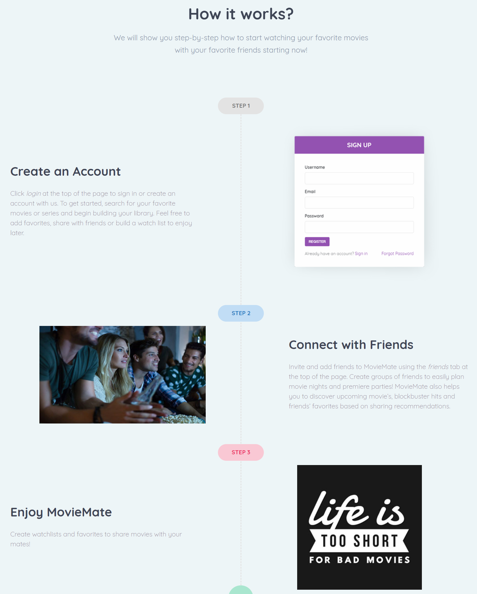

---
### What This Application Does
Have you ever watched a great movie, and you want to tell your friends about it – but you forgot where you watched it? Whether you are looking for a Movie database website, a Streaming website or a Cinema website MovieMate is the perfect choice. With MovieMate, you can keep track of all the movies and series you love and make recommendations to friends! Here's how it works! 

---
### Your MovieMate Access

Click here for your [MovieMate](https://bootcampmoviemate.herokuapp.com/) access.

---
### APIs
* OMDB
* Fandango (future)

---
### Hosted on Heroku

A working version of MovieMate can be found at [https://bootcampmoviemate.herokuapp.com/](https://bootcampmoviemate.herokuapp.com/ "MovieMate")

---
### Technology Used
* HTML | CSS
* [React](https://reactjs.org/docs/getting-started.html)
* [Node.js](https://nodejs.org/en/docs/)
* [MySQL](https://dev.mysql.com/doc/)
* [Passport.js](http://www.passportjs.org/docs/username-password/)
* [bcrypt-nodejs](https://www.npmjs.com/package/bcrypt-nodejs)
* [Heroku](https://bootcampmilliways.herokuapp.com/)

----
### Plugins
* [Bootstrap](https://getbootstrap.com/)
* [Isotope](https://isotope.metafizzy.co/)
* [Slider Revolution](https://codecanyon.net/item/slider-revolution-responsive-jquery-plugin/2580848?ref=gnodesign)
* [Mmenu](https://mmenujs.com/)

----
### © 2019 Built By

 - [Cheree Nielson](https://github.com/ChereeNielson): Team Lead | FE | [LinkedIn](https://www.linkedin.com/in/chereenielson/)
 - [Eric Sayer](https://github.com/sayex): Project Czar | BE | [LinkedIn](https://www.linkedin.com/in/eric-sayer-b6272591/)
 - [John Filiaga](https://github.com/jdfili): React Master | FE | [LinkedIn](https://www.linkedin.com/in/john-filiaga-8a2758171/)
 - [Katie Loyola](https://github.com/katieloyola): Presentation Specialist | FE | [LinkedIn](https://www.linkedin.com/in/katieloyola/)
 - [Stan Bakalov](https://github.com/sunnybakalov): React Master | FE | [LinkedIn](https://www.linkedin.com/in/stan-bakalov-1b4016b8/)